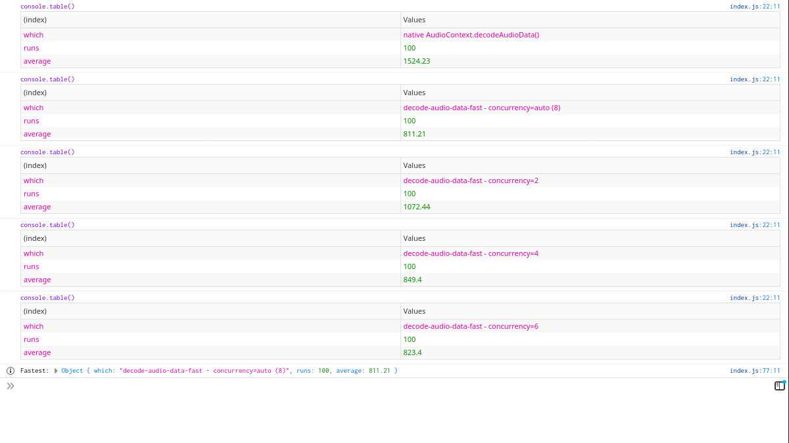
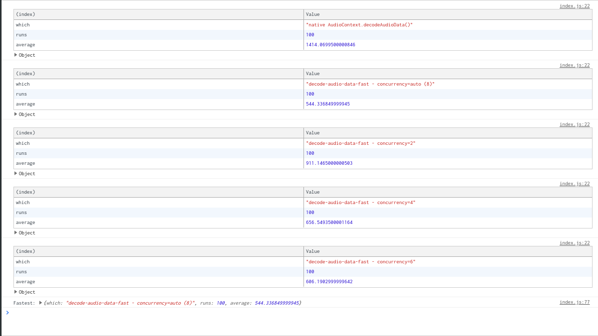

# decode-audio-data-fast

Decode audio file data **in the browser** from a [File](https://developer.mozilla.org/en-US/docs/Web/API/File)/[Blob](https://developer.mozilla.org/en-US/docs/Web/API/Blob) into a [AudioBuffer](https://developer.mozilla.org/en-US/docs/Web/API/AudioBuffer) using [AudioContext.decodeAudioData()](https://developer.mozilla.org/en-US/docs/Web/API/BaseAudioContext/decodeAudioData).

This package was originally created and is used in [soundcut](https://github.com/soundcut/app).

## Why decoding audio file data ?

In the current state of [Web Audio API](https://developer.mozilla.org/docs/Web/API/Web_Audio_API), there is a variety of use-cases where one might need to decode a file (`Blob`, or `ArrayBuffer`) audio data (`AudioBuffer`) (though the current APIs are arguably quite inneficient at this, decoding the whole file upfront), including but not limited to:

- [Drawing audio waveform](https://github.com/soundcut/app/blob/9feb2fe161e95e34c7a36e7ddff840d67b1f6d97/shared/components/WaveForm.js)
- Audio manipulation, such as looping, etc...

## Why use this over native `AudioContext.decodeAudioData()` ?

`AudioContext.decodeAudioData()` is **slow** and **does not work for large files**.

By splitting the source into chunks and decoding these in concurrently, `decode-audio-data-fast` works around the native API's limitations.

## Usage

```sh
npm i --save @soundcut/decode-audio-data-fast
```

### ESM

```js
import { getFileAudioBuffer } from '@soundcut/decode-audio-data-fast';

function decodeFileAudioData(file) {
  const audioCtx = new (window.AudioContext || window.webkitAudioContext)();
  return getFileAudioBuffer(file, audioCtx);
}
```

### CJS

```js
const { getFileAudioBuffer } = require('@soundcut/decode-audio-data-fast');

function decodeFileAudioData(file) {
  const audioCtx = new (window.AudioContext || window.webkitAudioContext)();
  return getFileAudioBuffer(file, audioCtx);
}
```

### UMD

```html
<script src="{YOUR_HOST}/decode-audio-data-fast.standalone.umd.min.js"></script>
<script>
  function decodeFileAudioData(file) {
    const audioCtx = new (window.AudioContext || window.webkitAudioContext)();
    return window.DADF.getFileAudioBuffer(file, audioCtx);
  }
</script>
```

### CDN (unpkg)

https://unpkg.com/@soundcut/decode-audio-data-fast

See all files published in [`./dist` directory](https://github.com/soundcut/decode-audio-data-fast/tree/master/dist).

## Are there other alternatives ?

[Yes](https://github.com/audiojs/audio-decode). However, it appears `decode-audio-data-fast` is **twice as fast**.

## Supported formats

At the moment, `decode-audio-data-fast` only supports `mp3` files that can be read through [mp3-parser](https://github.com/biril/mp3-parser).

## Benchmarks

See [`./benchmark` directory](benchmark/).

Visit [decodeAudioData / decode-audio-data-fast benchmark page](https://soundcut.github.io/decode-audio-data-fast/benchmark/) (open your browser console, wait a reasonably long time for all the benchmarks to run).





Test file is a 13MB 320kbps CBR MP3 export of https://www.youtube.com/watch?v=BigolJfoANw

## Options

The last argument of `getFileAudioBuffer` is an optional `options: { concurrency: number }` object:

```js
getFileAudioBuffer(file, audioCtx, { concurrency: 4 })
```

When omitted, `getFileAudioBuffer` will use "automatic concurrency mode", relying on [`navigator.hardwareConcurrency`](https://developer.mozilla.org/docs/Web/API/NavigatorConcurrentHardware/hardwareConcurrency):

```js
const DEFAULT_CONCURRENCY = 4;
const CONCURRENCY =
  ((typeof navigator !== 'undefined' && navigator.hardwareConcurrency) || 1) > 2
    ? navigator.hardwareConcurrency
    : DEFAULT_CONCURRENCY;
```

[See rationale for "automatic concurrency mode" on Twitter.](https://twitter.com/tpillard/status/1297562478822543360)

## Browser support

*FIXME*

This module is intended for ~modern browsers, uses and assumes availability of the following syntax/API, among others:

- [async/await](https://developer.mozilla.org/en-US/docs/Web/JavaScript/Reference/Operators/await)
- [decodeAudioData](https://developer.mozilla.org/en-US/docs/Web/API/BaseAudioContext/decodeAudioData)

This module has somewhat been tested on Firefox/Chrome, for desktop and mobile, and currently has known issues with Safari.
